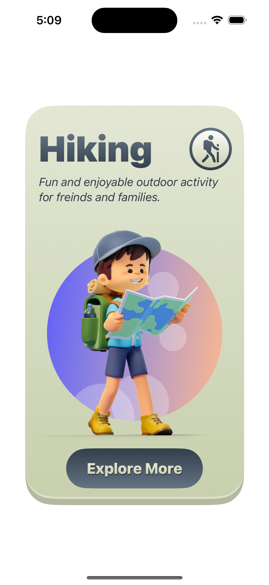
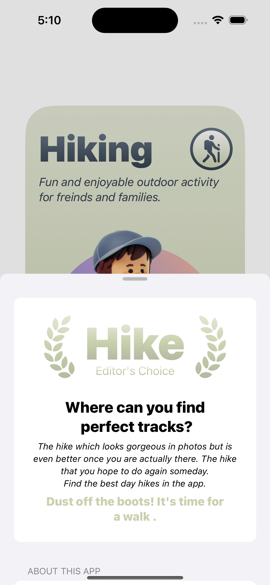

# Hike - SwiftUI Showcase

Hike is a stunning SwiftUI-based iOS app designed to inspire users to discover and explore breathtaking hiking trails. The app serves as a showcase for SwiftUI, highlighting its capabilities in creating beautiful card views and an elegant settings screen.

## Features

- **Card Views:** Experience SwiftUI's design prowess through beautifully crafted card views that showcase trail details in an engaging manner.

- **Settings Screen:** Explore the simplicity and elegance of SwiftUI in the app's settings screen, designed for a seamless user experience.

## Screenshots

    
    
    

## Acknowledgments

Based out of the [SwiftUI masterclass](https://credo.academy/swiftui-course.html) by [credo.academy](https://credo.academy)

